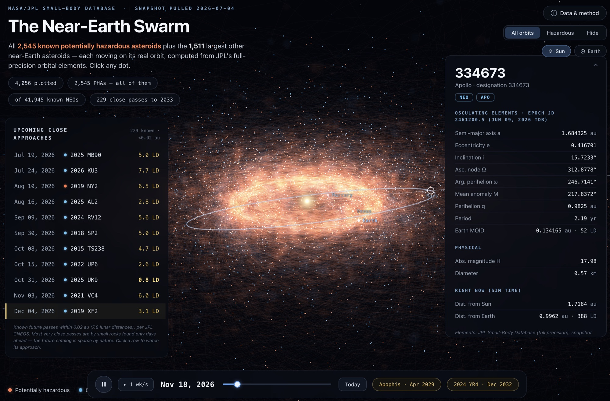

# Earth Swarm

A full-screen visualizer of near-Earth asteroids: every known potentially hazardous
asteroid plus the largest other NEOs, each moving on its real orbit via two-body
Keplerian propagation computed live in the browser from JPL's full-precision
orbital elements.



## Run locally

Any static file server works (ES modules require http, not file://):

```sh
python3 -m http.server 8137
# then open http://localhost:8137
```
...or click my github pages above!

## Data sources

All astronomical data comes from NASA/JPL's public, citable services:

- **[JPL Small-Body Database Query API](https://ssd-api.jpl.nasa.gov/doc/sbdb_query.html)**
  (`ssd-api.jpl.nasa.gov/sbdb_query.api`) — full-precision osculating orbital
  elements, absolute magnitudes (H), and diameters for every plotted asteroid,
  from the catalog maintained by JPL's Solar System Dynamics group.
- **[JPL CNEOS Close-Approach Data API](https://ssd-api.jpl.nasa.gov/doc/cad.html)**
  (`ssd-api.jpl.nasa.gov/cad.api`) — every known Earth close approach within
  0.02 au through the end of 2033, as computed by the Center for Near-Earth
  Object Studies.
- **[JPL SSD Approximate Positions of the Planets](https://ssd.jpl.nasa.gov/planets/approx_pos.html)**
  — Keplerian mean elements (valid 1800–2050) used for the Mercury–Mars
  ephemeris.

The "potentially hazardous" classification (Earth MOID ≤ 0.05 au and H ≤ 22.0)
follows [CNEOS's definition](https://cneos.jpl.nasa.gov/about/neo_groups.html).

## Data snapshot

- `neos.json` — orbital elements + physical parameters for all PHAs and the
  largest other NEOs (Small-Body Database Query API)
- `cad.json` — all known close approaches within 0.02 au through 2033
  (CNEOS Close-Approach Data API)
- `meta.json` — catalog counts used by the header

To refresh the snapshot, re-run the pull (server-side only — NASA's terms
prohibit calling these APIs from a live website) and re-commit:

```sh
node scripts/fetch_data.mjs
```

## Structure

- `js/kepler.js` — Kepler solver, element→position propagation, planet ephemeris
- `js/gl.js` — raw WebGL renderer (additive orbit lines, soft point sprites)
- `js/main.js` — simulation loop, camera, picking, UI
- `css/style.css` — dark theme, SF Pro system font stack

## Note
Best read on a computer; not optimized for mobile viewing
